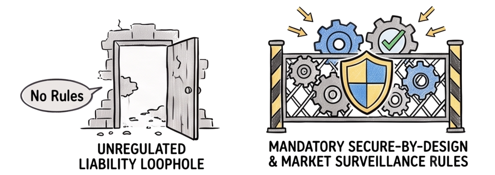
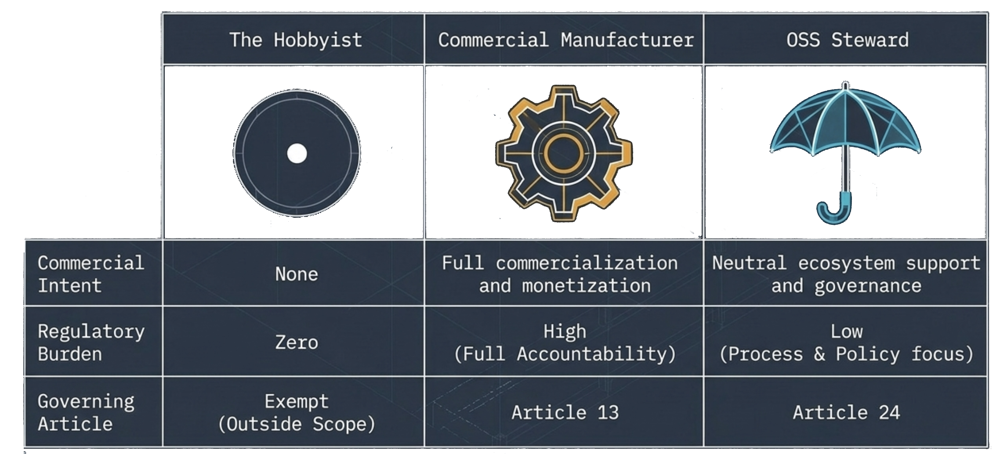

[<!-- .element style="height: 120px; margin: 0 auto 4rem auto; background: transparent;" -->](https://reveals.lakruzz.com/markdownloader/?owner=mindovermachine-dev&repo=reveals&file=mom-cra-oss.md)

Compliant with the reveal.js 
`markdownloader` 
click the logo to see it live!

---
---

# Mind over Machine

We are a non-profit foundation combining a **think tank**, a **laboratory**, and a **community of practice**. Our mission is to explore and share regenerative approaches to software development that create a net positive long-term value for people and humanity.

---
---

<!-- .slide: style="font-size: 0.85em;" -->

## Open Source - before and after

EU's Cyber Resilince Act (CRA)

<!-- .element style="height: 350px; margin: 0 auto 4rem auto; background: transparent; align: left;" -->

Note:

---

## EU's Cyber Resilince Act

- **Mandates** _Secure-by-Desing_ for all products with digital elements
- **Paradigm shift** OSS is not a loop hole. EU market entry requires specific legal accountability
- **Goals** Secure free movement of secure products

---
---

## Open Source - three roles

<!-- .element style="height: 350px; margin: 0 auto 4rem auto; background: transparent; align: left;" -->

---

<!-- .slide: style="font-size: 0.8em;" -->

## Ultimate Responsibility Rests with the Manufacturer

- **[Article 13](https://www.european-cyber-resilience-act.com/Cyber_Resilience_Act_Article_13.html):** The legal obligation to comply with the CRA falls squarely on the manufacturer

- **Manufacturere Definition:** The economic operator that places the final digital product on the EU market

---

<!-- .slide: style="font-size: 0.85em;" -->

## OSS Stewards Are Recognized Legal Entities, Not Mandatory Gatekeepers

- **[Article 24](https://www.european-cyber-resilience-act.com/Cyber_Resilience_Act_Article_24.html)**: Defines light-weight obligations specifically for Open-Source Software Stewards

- **OSS Steward Definition:** Not-for-profit legal entities that provide sustained support and infrastructure for FOSS projects

---

## OSS hobbyists are completely safe

- **Keep doning what your doing** You as an individual continue to have all the freedom in the world to write public code.
- **If a manufacturere uses your OSS code** Then _they_ become liable for _your work_.
- **But the second you start charging...** ...customers for your product, you tranform into the _manufacturere_ role yourself!

---
---

## Manufacturere responsibilities

- Technical Documentation ([Article&nbsp;31](https://www.european-cyber-resilience-act.com/Cyber_Resilience_Act_Article_31.html))
  - SBOM (Software Bill Of Materials)
  - Cybersecurity Risk Assessment
  - Test Reports & Verification Data
  - Evidence of secure-by-design
  - Architectural design
  - Vulnerability scans
- EU Declaration of Conformity ([Article&nbsp;28](https://www.european-cyber-resilience-act.com/Cyber_Resilience_Act_Article_28.html))
- CE Marking (Articles&nbsp;[29](https://www.european-cyber-resilience-act.com/Cyber_Resilience_Act_Article_29.html)&nbsp;&&nbsp;[30](https://www.european-cyber-resilience-act.com/Cyber_Resilience_Act_Article_30.html))
- Mandatory Vulnerability & Incident Reports ([Article&nbsp;14](https://www.european-cyber-resilience-act.com/Cyber_Resilience_Act_Article_14.html))

<!-- .element style="font-size: 0.8em;" -->

---

## OSS Steward responsibilities

- Verifiable Cybersecurity Policy ([Article&nbsp;24](https://www.european-cyber-resilience-act.com/Cyber_Resilience_Act_Article_24.html)(1))
- Policy Documentation for Authorities ([Article&nbsp;24](https://www.european-cyber-resilience-act.com/Cyber_Resilience_Act_Article_24.html)(2))
- Targeted Infrastructure Incident Reports ([Article&nbsp;24](https://www.european-cyber-resilience-act.com/Cyber_Resilience_Act_Article_24.html)(3) &[Article&nbsp;14](https://www.european-cyber-resilience-act.com/Cyber_Resilience_Act_Article_14.html))
- Voluntary Security Attestations ([Article&nbsp;25](https://www.european-cyber-resilience-act.com/Cyber_Resilience_Act_Article_25.html))

---

## Split work

In practice, the relationship between a commercial manufacturer and a non-profit OSS steward works as a co-funded alliance model

<!-- .element style="font-size: 0.8em;" -->

- Commercial manufacturers support, donate or pay retainers and alliance membership fees to the steward foundation
- In return, the steward maintains the core open-source project under formal Article&nbsp;[24](https://www.european-cyber-resilience-act.com/Cyber_Resilience_Act_Article_24.html)+[25](https://www.european-cyber-resilience-act.com/Cyber_Resilience_Act_Article_25.html)
- The steward **also** maintains the development pipeline so it produces the required output that the manufacturere can efforlessly consume to comply with [Article&nbsp;31](https://www.european-cyber-resilience-act.com/Cyber_Resilience_Act_Article_24.html).

<!-- .element style="font-size: 0.8em;" -->

---

## Split responsibilities

While the manufacturere remain fully liable — a lot of the heavy lifting in the SLDC is liftet off to the foundation's personel. The steward will set the quality standards.

<!-- .element style="font-size: 0.8em;" -->

Most often the lead developers will remain exactly the same as before, but with the added benefit, that lead developers will _continue_ to be leads - even when employment with manufaturere is terminated.

<!-- .element style="font-size: 0.8em;" -->

---
---

<!-- .slide: data-background="#1d4333" -->

<!-- .element style="height: 450px; margin: 0 auto 4rem auto; background: transparent; align: left;" -->
