[<!-- .element style="height: 120px; margin: 0 auto 4rem auto; background: transparent;" -->](https://reveals.lakruzz.com/markdownloader/?owner=mindovermachine-dev&repo=reveals&file=mom-pitch.md) 

Compliant with the reveal.js 
`markdownloader` 
click the logo to see it live!

---
---

# Mind over Machine

We are a non-profit foundation combining a **think tank**, a **laboratory**, and a **community of practice**. Our mission is to explore and share regenerative approaches to software development that create a net positive long-term value for people and humanity.

---
---

## Public Money — Public Code
Study Use Modify Share

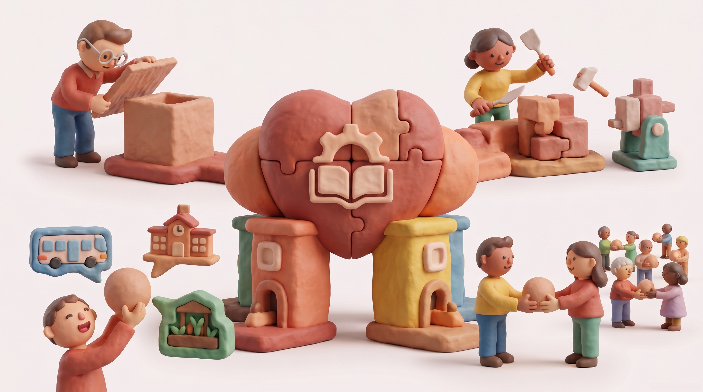<!-- .element style="height: 350px; margin: 0 auto 4rem auto; background: transparent; align: left;" -->

Note:

MoM FOSS Dev Stack operationaliserer princippet om "Public Money, Public Code". Baseret på de fire fundamentale FOSS friheder:

- **Study**: Retten til at undersøge, hvordan koden fungerer.
- **Use**: Retten til at anvende softwaren til ethvert formål.
- **Modify**: Retten til at tilpasse softwaren til lokale behov.
- **Share**: Retten til at distribuere kopier og forbedringer til fællesskabet.

---

<!-- .slide: style="font-size: 0.85em;" -->

<!-- .element style="position: absolute; top: -100px; left: -10px; height: 100px; margin: 0; background: transparent;" -->

## Public Money — Public Code

MoM FOSS Dev Stack operationaliserer princippet om "Public Money, Public Code". Baseret på de fire fundamentale FOSS friheder:

- **Study**: Retten til at undersøge, hvordan koden fungerer.
- **Use**: Retten til at anvende softwaren til ethvert formål.
- **Modify**: Retten til at tilpasse softwaren til lokale behov.
- **Share**: Retten til at distribuere kopier og forbedringer til fællesskabet.

---

<!-- .slide: data-background="#1d4333" -->

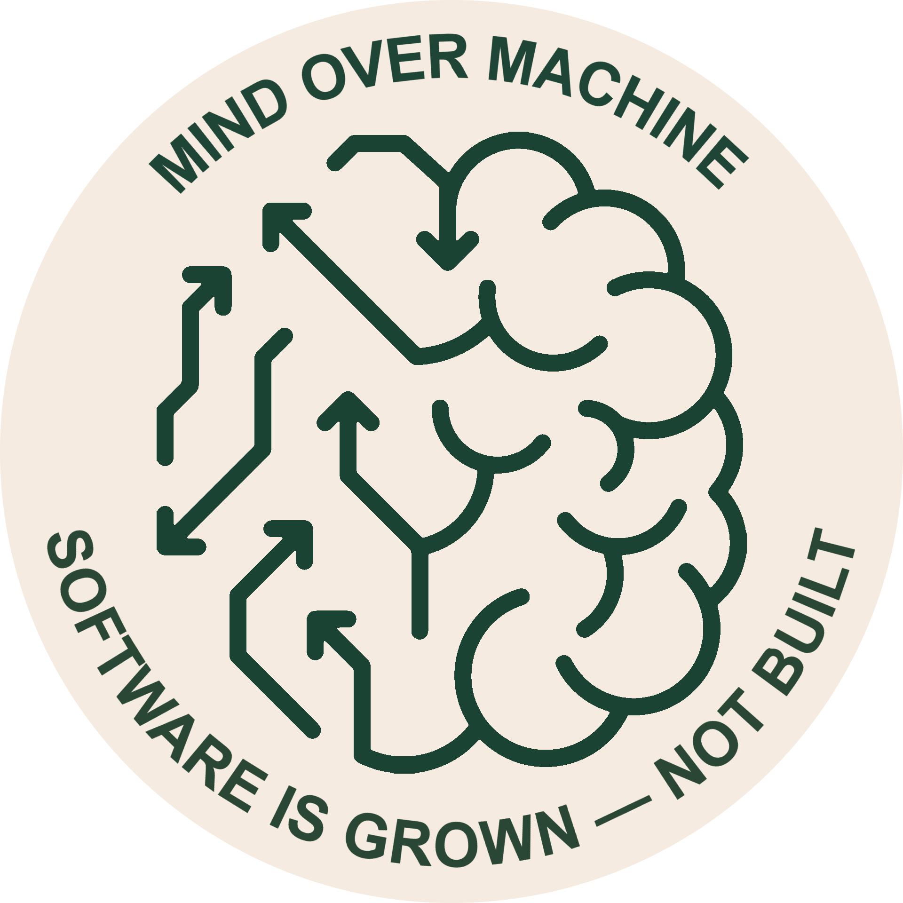<!-- .element style="height: 450px; margin: 0 auto 4rem auto; background: transparent; align: left;" -->

---
---

# Bryd kæden
Tag kontrol

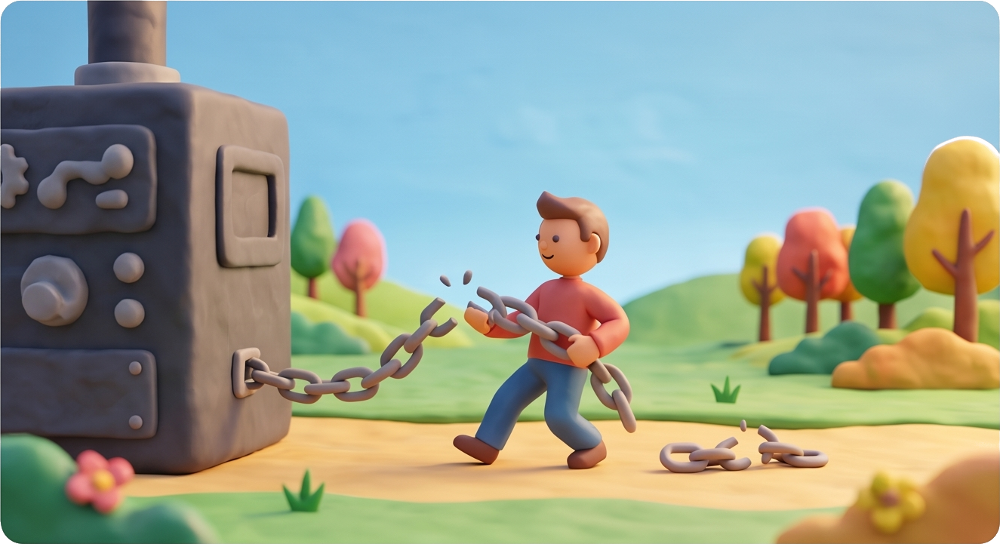<!-- .element style="height: 350px; margin: 0 auto 4rem auto; background: transparent; align: left;" -->

Note:

Europa befinder sig  i en fundamental magtforskydning. Digital suverænitet er transformeret fra et teknisk ideal til et geopolitisk og regulatorisk paradigme.  Med EU's **Digital Sovereignty Package** og principperne om **"Open Source First"** og **"European Preference"**, er det ikke længere tilstrækkeligt for danske kommuner at agere som passive licensbetalere. Vi skal skifte til en proaktiv model for teknologisk autonomi for at sikre, at kritiske infrastrukturer forbliver under demokratisk kontrol.

---

<!-- .slide: style="font-size: 0.8em;" -->

<!-- .element style="position: absolute; top: -75px; left: -10px; height: 100px; margin: 0; background: transparent;" -->

# Bryd kæden — tag kontrol

Europa befinder sig  i en fundamental magtforskydning. Digital suverænitet er transformeret fra et teknisk ideal til et geopolitisk og regulatorisk paradigme.

Med EU's **Digital Sovereignty Package** og principperne om **"Open Source First"** og **"European Preference"**, er det ikke længere tilstrækkeligt at agere som passive licensbetalere. Vi skal skifte til en proaktiv model for teknologisk autonomi for at sikre, at kritiske infrastrukturer forbliver under demokratisk kontrol.

---

<!-- .slide: data-background="#1d4333" -->

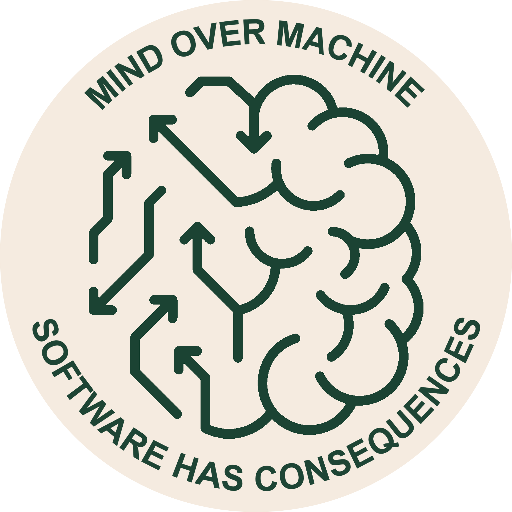<!-- .element style="height: 450px; margin: 0 auto 4rem auto; background: transparent; align: left;" -->

---
---

# MoM
(Moooar!)

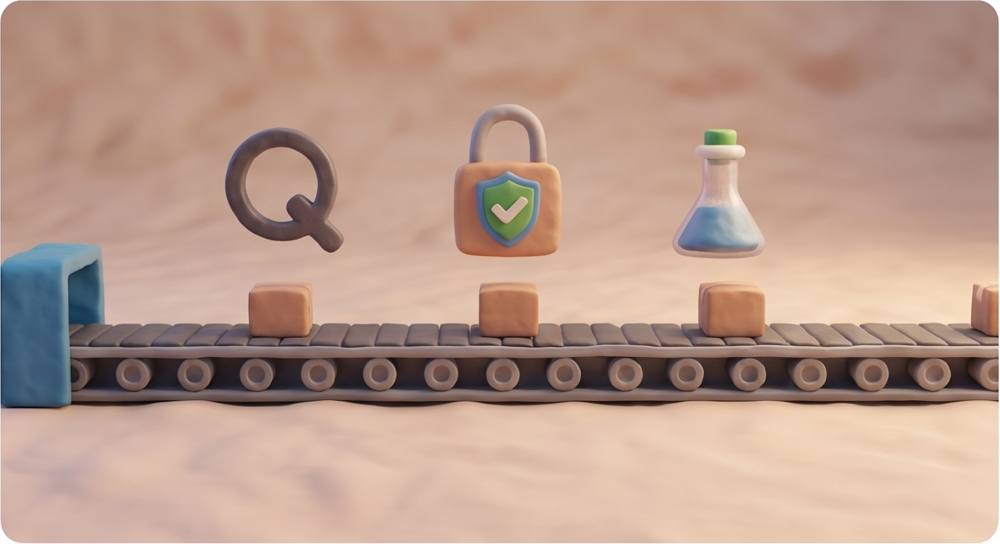<!-- .element style="height: 350px; margin: 0 auto 4rem auto; background: transparent; align: left;" -->

Note:

FOSS står ofte stærkt i princippet, men udfordres i praksis af frygt for manglende support/SLA'er, mangel på interne tekniske kompetencer samt stærke proprietære bindinger.

Mind over Machine fungere både som **Tænketank**, FOSS **Laboratorium** og som **Praksisfællesskab**. MoM leverer rådgivning, Udvikling og drift af FOSS produkter og et kontinuerligt engagement af et vidtspændende community af akademia, frivillige og professionelle.

MoM har som ambition at levere den fulde FOSS _Supply chain;_ Kvalitet, Sikkerhed, R&D

---

<!-- .element style="position: absolute; top: -120px; left: -10px; height: 100px; margin: 0; background: transparent;" -->

# Moooar!

FOSS står ofte stærkt _i princippet!_

...men udfordres i praksis af frygt for manglende support/SLA'er, mangel på interne tekniske kompetencer, et svigtende community, samt udefra påførte stærke proprietære bindinger.

---

<!-- .element style="position: absolute; top: -10px; left: -10px; height: 100px; margin: 0; background: transparent;" -->

# MoM

Mind over Machine fungere både som **Tænketank**, FOSS **Laboratorium** og som **Praksisfællesskab**. MoM leverer strategisk rådgivning på FOSS, udvikling og drift af FOSS produkter og et kontinuerligt engagement af et vidtspændende community som samler akademia, frivillige og professionelle.

MoM kan levere på den fulde FOSS _Supply chain:_

**Kvalitet, Sikkerhed, R&D**

---

<!-- .slide: data-background="#1d4333" -->

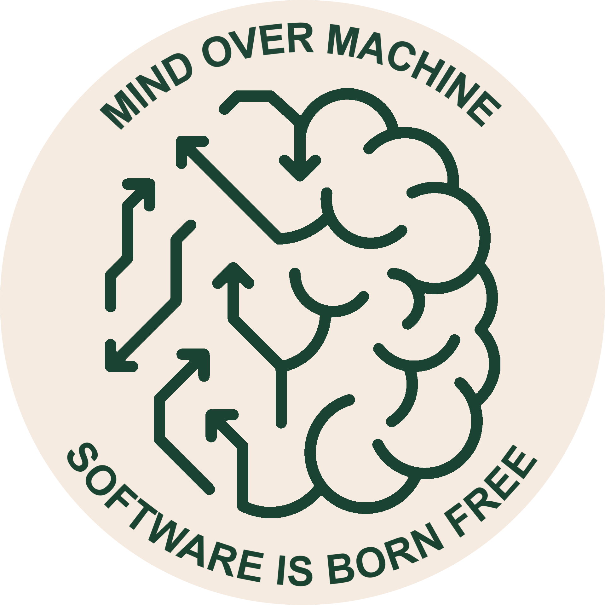<!-- .element style="height: 450px; margin: 0 auto 4rem auto; background: transparent; align: left;" -->

---
---

# Suverænitet

Med Lov Skal Man Land Bygge

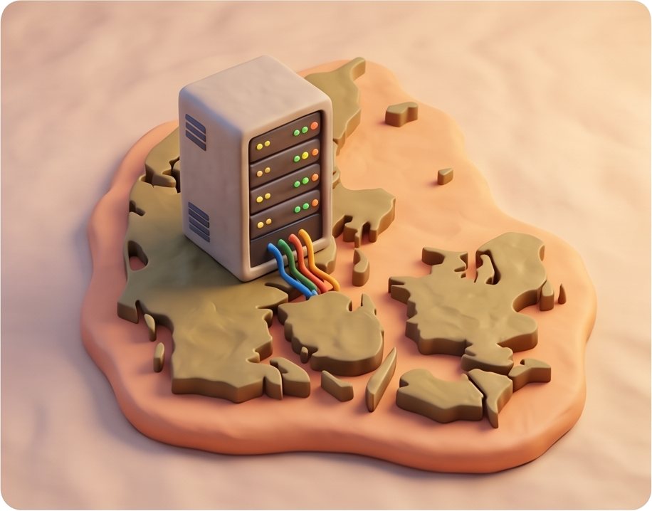<!-- .element style="height: 350px; margin: 0 auto 4rem auto; background: transparent; align: left;" -->

Note:

Den nuværende kommunale it-arkitektur er i høj grad præget af fragmentering og en dyb afhængighed af proprietære cloud-platforme. Dette skaber en "innovationstørke", hvor data er låst i siloer, og hvor små it-organisationer drænes for ressourcer til vedligeholdelse og compliance.

Ved at anvende MoM’s "Rubric of Evilness" kan vi kvantificere risikoen i vores værktøjskæde. Hvor FOSS-værktøjer som Forgejo scorer 1,5, lander proprietære platforme som Facebook og Instagram over 90 på "evilness skalaen"

---

# Suverænitet

<!-- .element style="position: absolute; top: -110px; left: -10px; height: 100px; margin: 0; background: transparent;" -->

Den nuværende kommunale it-arkitektur er i høj grad præget af fragmentering og en dyb afhængighed af proprietære cloud-platforme. Dette skaber en "innovationstørke", hvor data er låst i siloer, og hvor små it-organisationer drænes for ressourcer til vedligeholdelse og compliance.

---

# Suverænitet

<!-- .element style="position: absolute; top: -130px; left: -10px; height: 100px; margin: 0; background: transparent;" -->

Ved at anvende MoM’s "Rubric of Evilness" kan vi kvantificere risikoen i vores værktøjskæde. Hvor FOSS-værktøjer som Forgejo scorer 1,5, lander proprietære platforme som Facebook og Instagram over 90 på "evilness skalaen"

---

<!-- .slide: data-background="#1d4333" -->

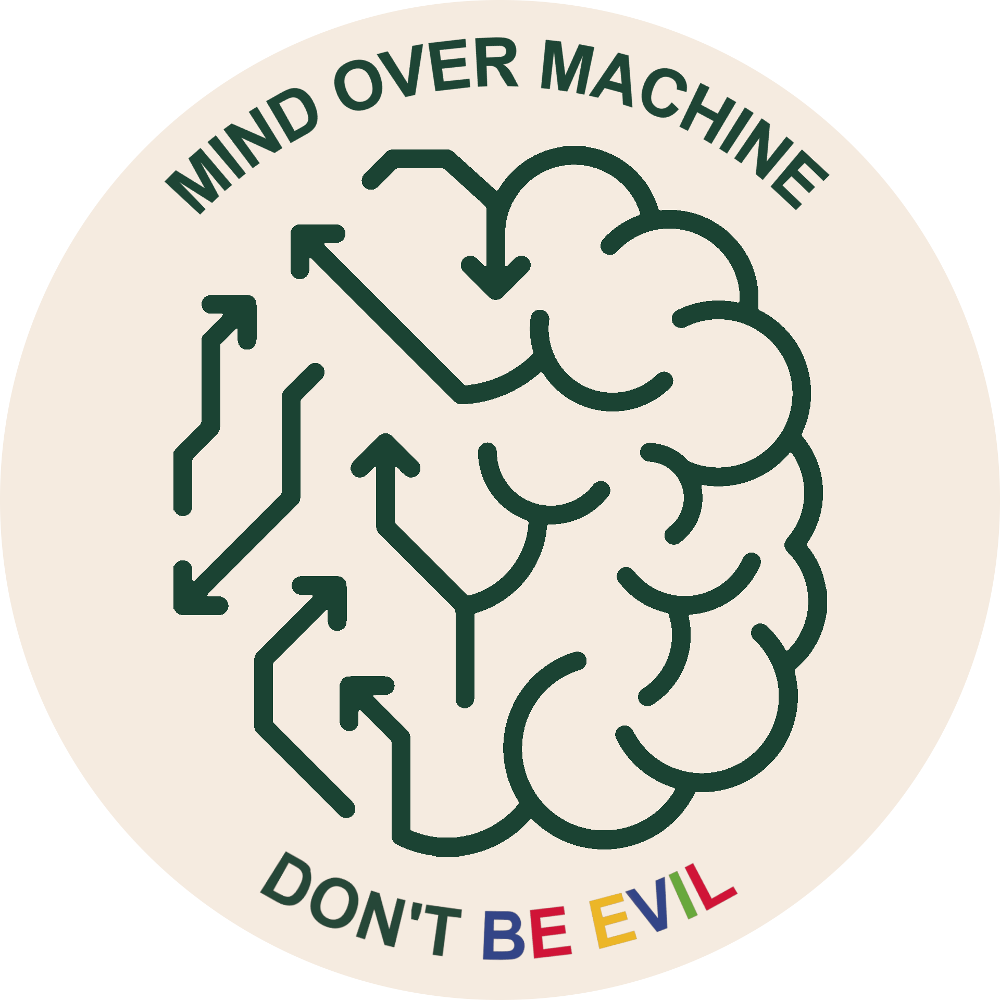<!-- .element style="height: 450px; margin: 0 auto 4rem auto; background: transparent; align: left;" -->

---
---

# Pan Europæisk Fællesskab

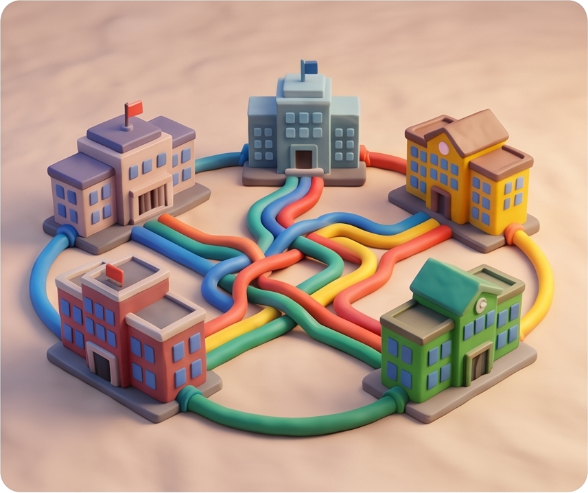<!-- .element style="height: 350px; margin: 0 auto 4rem auto; background: transparent; align: left;" -->

Note:

**Interoperable Europe Act (Forordning 2024/903):**

Bindende lovgivning, der pålægger offentlige administrationer i EU at foretage interoperabilitetsvurderinger og fremmer deling samt genbrug af FOSS-løsninger.

**Cyber Resilience Act (CRA):**
Indfører sikkerhedskrav for software. CRA anerkender FOSS, men stiller krav om FOSS-stewardship og forsyningskædesikkerhed ved kommerciel anvendelse.

---

# Pan Europæisk Fællesskab

<!-- .element style="position: absolute; top: -130px; left: -10px; height: 100px; margin: 0; background: transparent;" -->

**Interoperable Europe Act (Forordning 2024/903):**

Bindende lovgivning, der pålægger offentlige administrationer i EU at foretage interoperabilitetsvurderinger og fremmer deling samt genbrug af FOSS-løsninger.

---

# Pan Europæisk Fællesskab

<!-- .element style="position: absolute; top: -150px; left: -10px; height: 100px; margin: 0; background: transparent;" -->

**Cyber Resilience Act (CRA):**
Indfører sikkerhedskrav for software. CRA anerkender FOSS, men stiller kvalitetskrav som fordrer FOSS-stewardship og forsyningskædesikkerhed ved kommerciel anvendelse.

---

<!-- .slide: data-background="#1d4333" -->

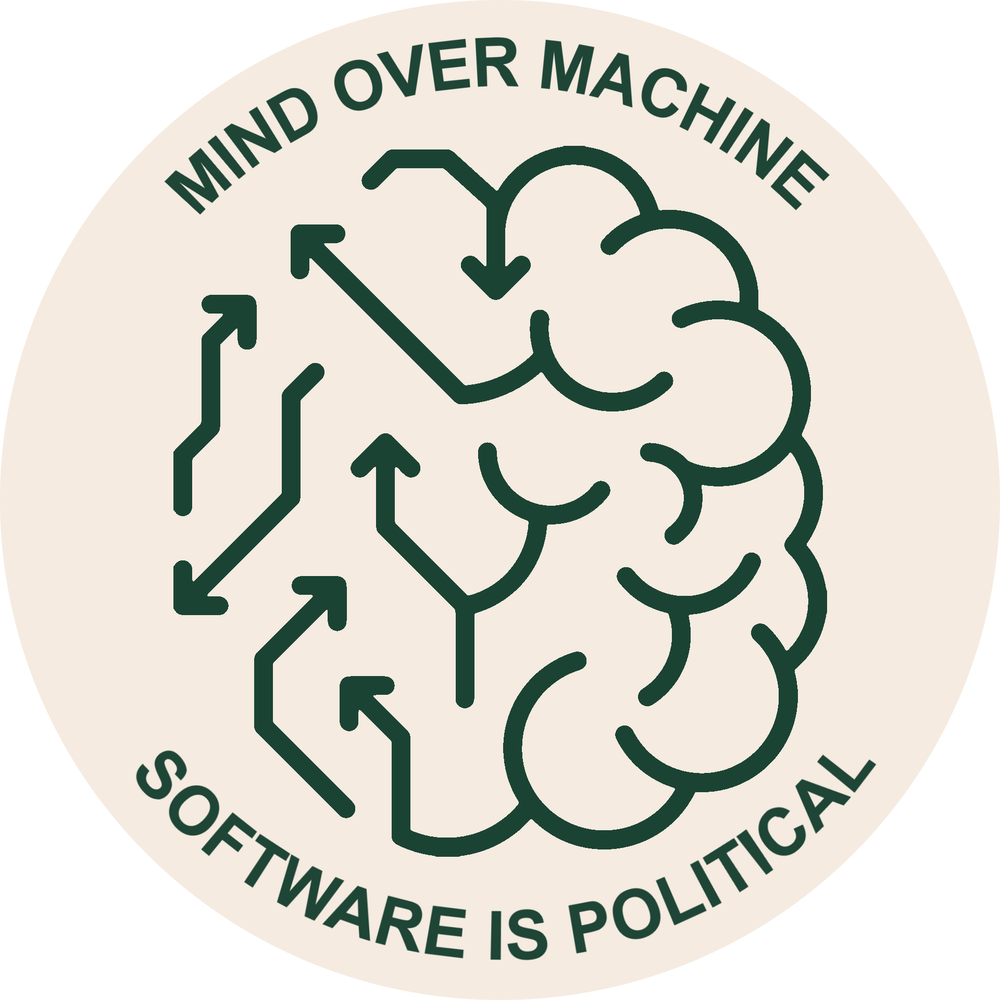<!-- .element style="height: 450px; margin: 0 auto 4rem auto; background: transparent; align: left;" -->

---
---

<!-- .slide: data-background="#1d4333" -->

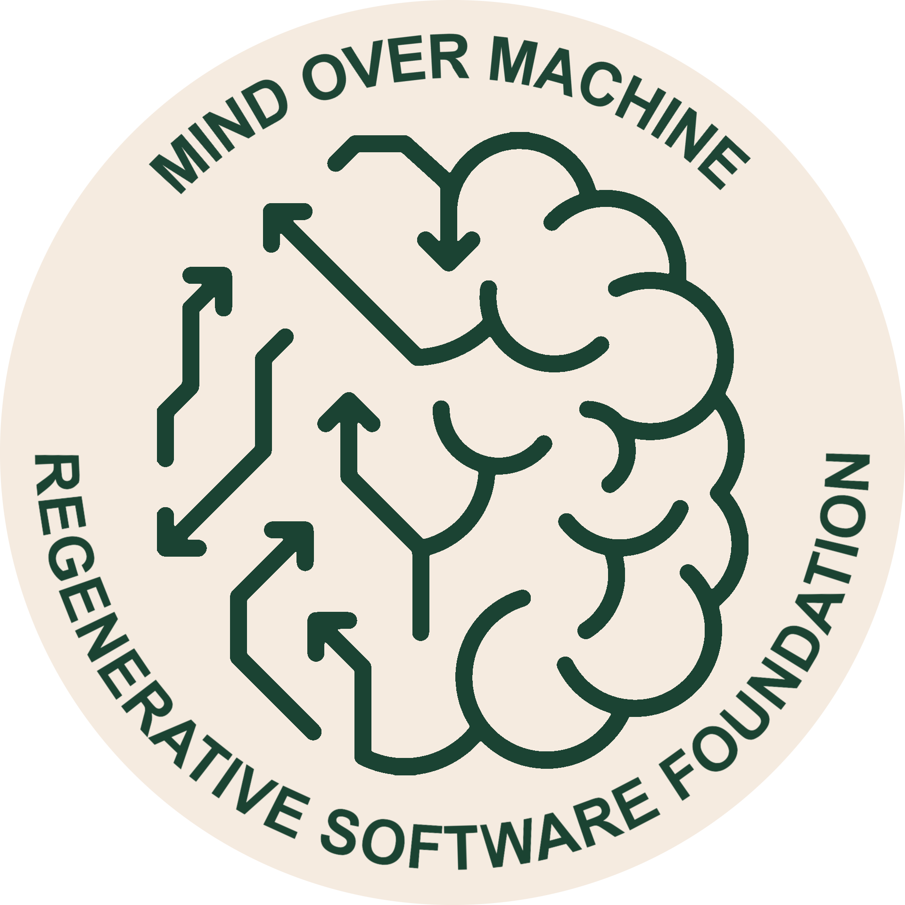<!-- .element style="height: 450px; margin: 0 auto 4rem auto; background: transparent; align: left;" -->

---

<!-- .slide: data-background="#1d4333" -->

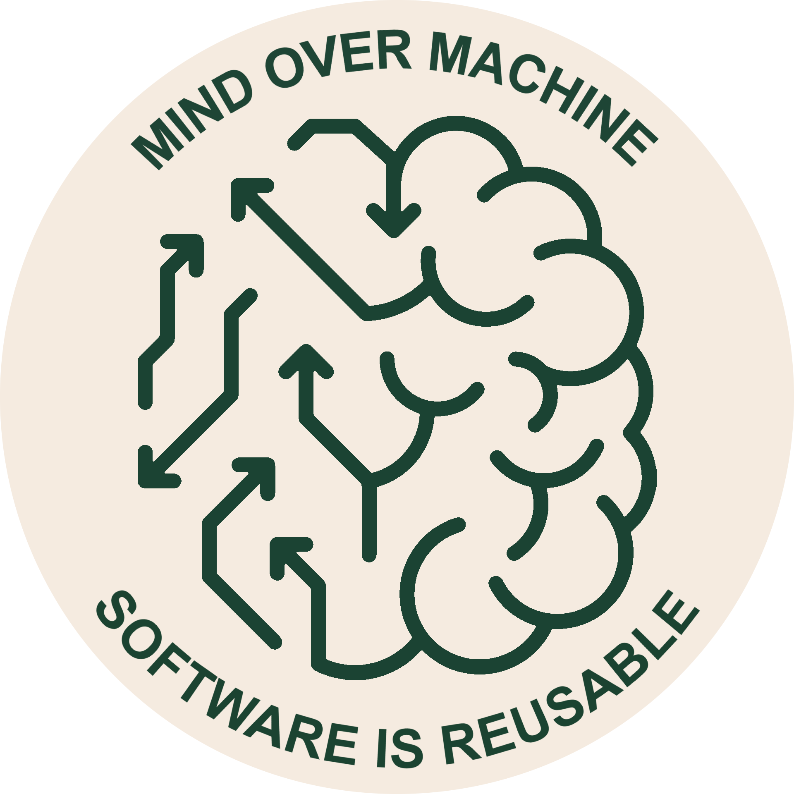<!-- .element style="height: 150px; margin: 0 auto 4rem auto; background: transparent; align: left;" -->
<!-- .element style="height: 150px; margin: 0 auto 4rem auto; background: transparent; align: left;" -->
<!-- .element style="height: 150px; margin: 0 auto 4rem auto; background: transparent; align: left;" -->
<!-- .element style="height: 150px; margin: 0 auto 4rem auto; background: transparent; align: left;" -->
 
<!-- .element style="height: 150px; margin: 0 auto 4rem auto; background: transparent; align: left;" -->
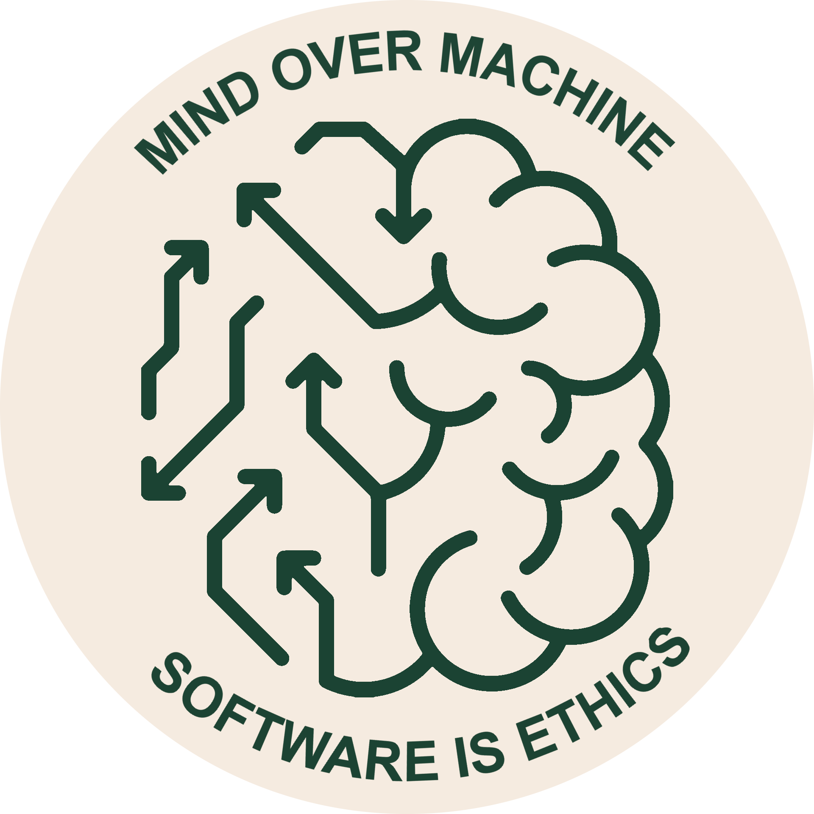<!-- .element style="height: 150px; margin: 0 auto 4rem auto; background: transparent; align: left;" -->
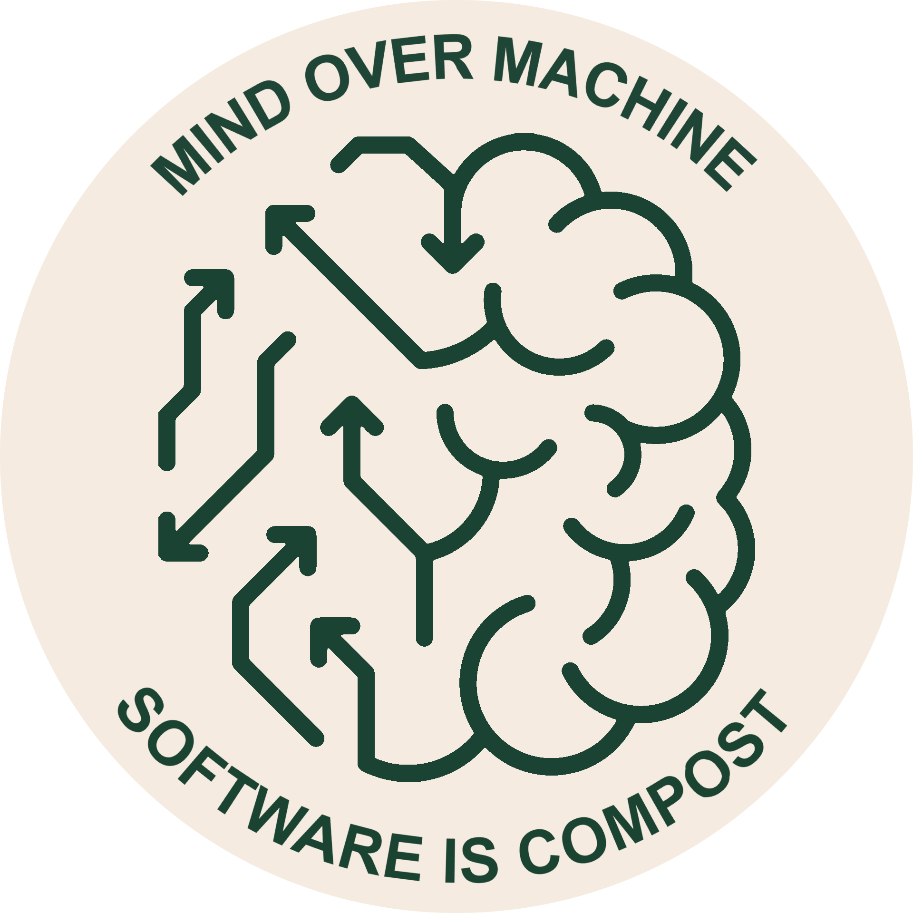<!-- .element style="height: 150px; margin: 0 auto 4rem auto; background: transparent; align: left;" -->
<!-- .element style="height: 150px; margin: 0 auto 4rem auto; background: transparent; align: left;" -->

